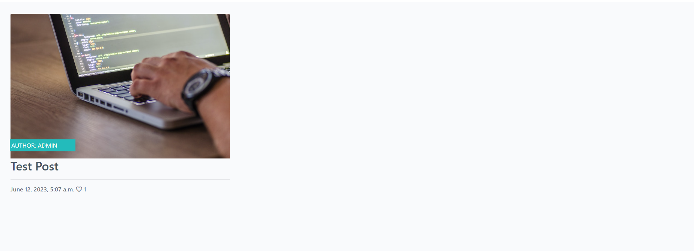

# Codestar

Codestar is a blog website that is geared towards coding, with the administrator posting entries and users can like and comment them. The project is build with Django and is a walkthrough project from the Code Institutes Fullstack Developer Program.

[Deployed Project Link](https://djng-blog.herokuapp.com/)

## Features 

### Existing Features

- __Navigation Bar__

  - Featured on all pages, the full responsive navigation bar includes links to, home, register, login and logout, the register and login links are only visible if logged out and the logout only if logged in. The logo also links to home.
  - This section will allow the user to easily navigate from page to page across all devices without having to revert back to the previous page via the ‘back’ button. 

- __The Home Page__

  - The home page lists all the blog posts showing the image of the post, the author, the title, likes count and also the excerpt if there is one, with 3 posts per row and 1 post per row on small screens.
  - This section introduces the user to the blog with all the recent posts

- __Post Detail Page__

  - The post detail page shows the blogpost in its entirety and the comment section for the post, which includes previosu comments and if logged in, a comment posting form. 

- __Register Page__

  - Here the user creates an account with a username and password, with optional email.
  - The logged in benefits are being able to like and comment on posts. 

- __The Sign In__

  - This is where the signs in to be able to like and comment on posts using their username and password.

- __The Footer__ 

  - The footer section includes links to the relevant social media sites for Codestar. The links are not currently wired up since this is a fictional blog. 
  - The footer is valuable to the user as it encourages them to keep connected via social media

### Features Left to Implement

- Search feature - Useful in the future for users to find an old blogpost when there are hundreds of entries.

## Testing 

### Validator Testing 

- HTML
  - No errors were returned when passing through the official [W3C validator](https://validator.w3.org/nu/?doc=https%3A%2F%2Fdjng-blog.herokuapp.com%2F)
- CSS
  - No errors were found when passing through the official [(Jigsaw) validator](https://jigsaw.w3.org/css-validator/validator?uri=https%3A%2F%2Fdjng-blog.herokuapp.com%2F&profile=css3svg&usermedium=all&warning=1&vextwarning=&lang=en)
- Python
  - Auto PEP8 was installed and used throughout the project, all issues were fixed as they appeard.

## Deployment

- add prebuild script
- add Procfile
- deploy to Heroku

### Content 

- The icons in the project were taken from [Font Awesome](https://fontawesome.com/)

### Media

- The images used in the project were provided by Code Institute
